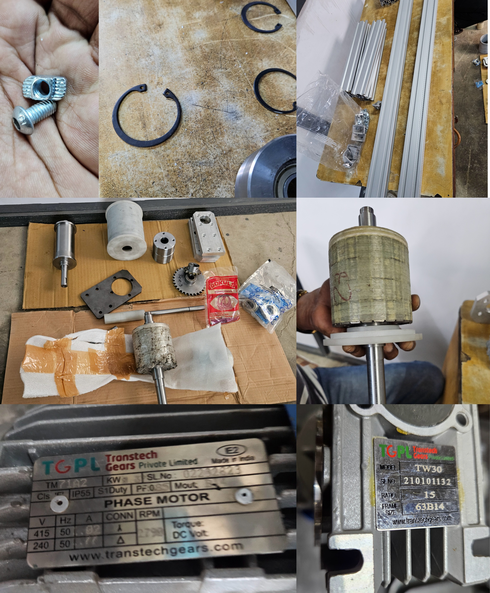
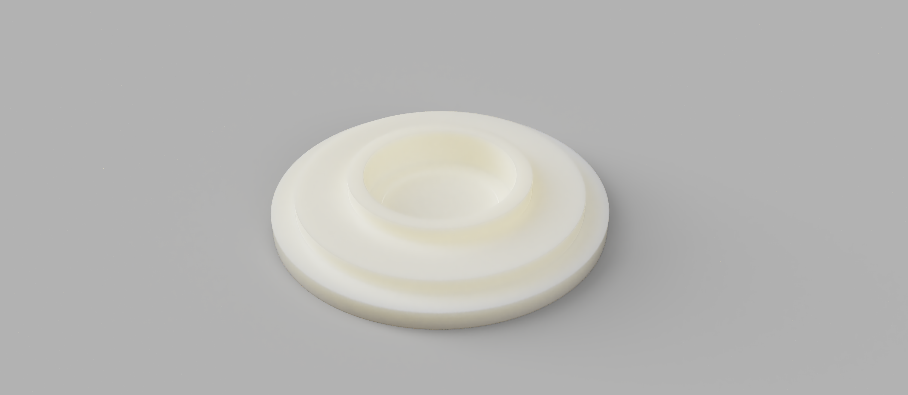
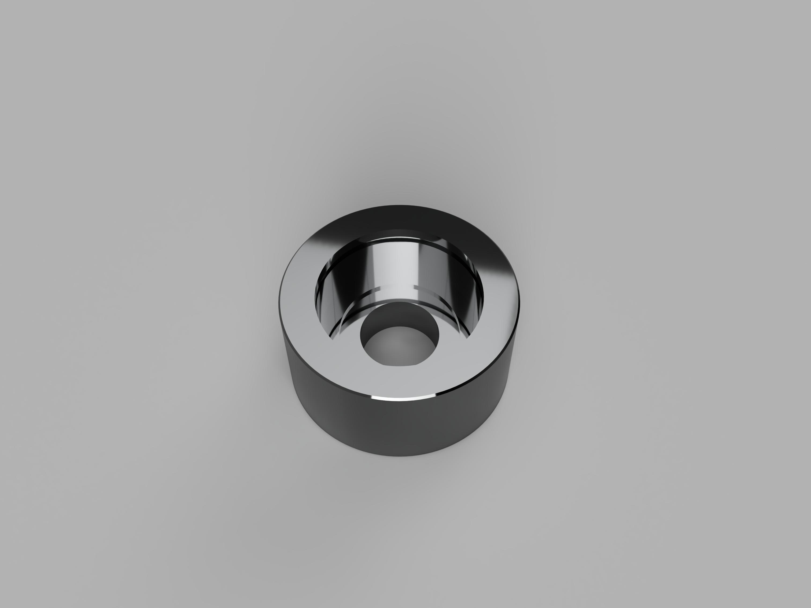
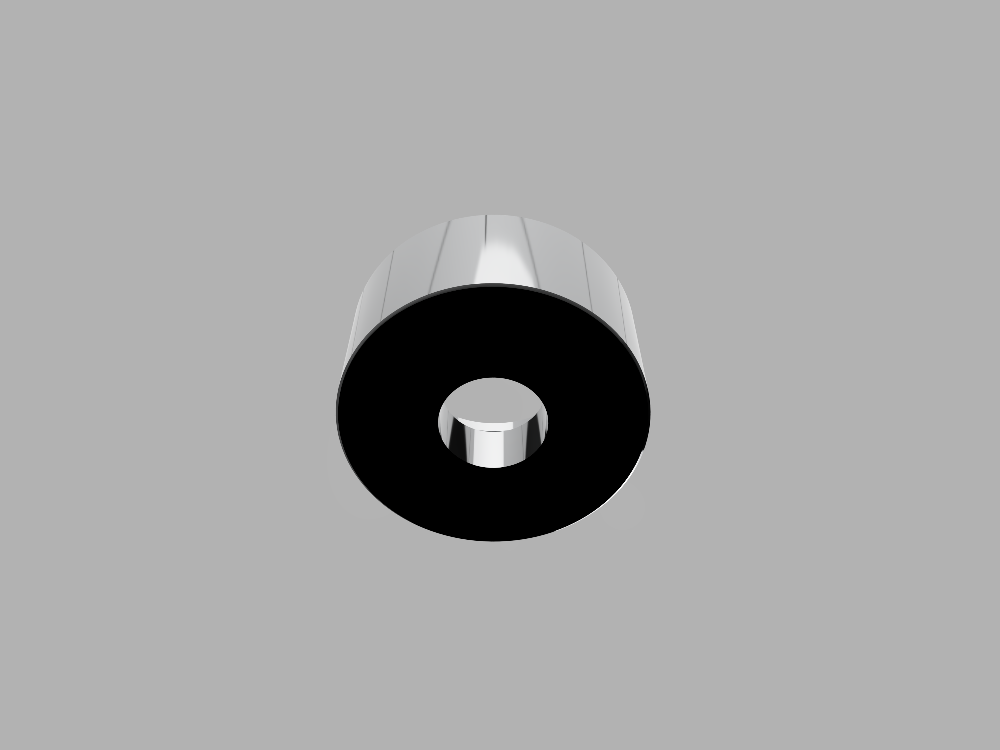
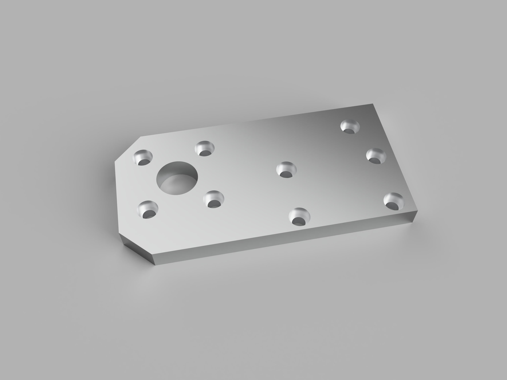

# Miniaturized Eddy Current Separator

A compact, conveyor-based prototype for automatically separating non-ferrous metals from mixed material streams using electromagnetic induction.

**Project period:** November 2024 - January 2025  
**Built by:** Karthik SB  
**Tools:** AutoCAD, Fusion 360, Arduino IDE, MIT App Inventor

<p align="center">
  
</p>

## Project ownership

I independently completed the mechanical design, CAD work, fabrication coordination, assembly, electronics and app integration, testing, and project documentation. The college report followed the assigned group-submission format; this repository documents the engineering work I personally carried out.

## How it works

Material travels along a conveyor and passes over a high-speed permanent-magnet rotor. The rotor produces a rapidly changing magnetic field, which induces eddy currents in conductive, non-ferrous pieces. Their opposing magnetic field creates a repulsive force, throwing them farther than non-conductive material and enabling physical separation.

## System overview

| Subsystem | Implementation |
|---|---|
| Structure | Aluminium extrusion frame with machined brackets and bearing mounts |
| Separation | Magnetic rotor inside a smooth PVC outer shell beneath a PU-coated conveyor belt |
| Drivetrain | Two three-phase motors, chain/sprocket transmission, 15:1 gearbox, and 1 HP VFD |
| Sensing | 20 kg load cell, HX711 amplifier, ultrasonic bin-level sensor |
| Control and telemetry | Arduino Uno, HC-05 Bluetooth module, and MIT App Inventor interface |
| Mechanical design | AutoCAD fabrication drawings and Fusion 360 component models/renders |

## Design and build

- Designed the magnetic roller shaft, drive roller, PVC shell, flanges, and left/right mounting brackets.
- Coordinated fabrication using EN-8 steel, aluminium, nylon, and PVC components.
- Built and aligned the conveyor, bearings, shafts, motors, chain drive, and guards.
- Upgraded the magnetic-roller motor from 1478 RPM to approximately 3000 RPM after early tests showed insufficient ejection force.
- Changed the conveyor gearbox from 7.5:1 to 15:1 to reduce belt speed and improve sorting.
- Calibrated the load-cell system and transmitted live weight data to a mobile app over Bluetooth.

## Test results

Tests used approximately 1 cm² samples with a thickness of 1 mm.

| Material | Density (g/cm³) | Conductivity (MS/m) | Measured throw distance (m) |
|---|---:|---:|---:|
| Aluminium | 2.7 | ~37 | 1.25-1.70 |
| Copper | 8.96 | ~58 | 1.00-1.60 |
| Brass | ~8.5 | ~15 | 0.90-1.50 |

The prototype separated aluminium, copper, and brass samples in multiple shapes, including plates, rings, spheres, and folded wire. Thicker copper pieces were less consistent because their higher mass required greater ejection force. The sensing subsystem also delivered calibrated, real-time weight readings to the mobile app.

## CAD previews

| Outer-shell flange | Magnetic-roller shaft flange |
|---|---|
|  |  |

| Shaft flange underside | Magnetic-shaft side bracket |
|---|---|
|  |  |

## Prototype gallery

The current gallery contains the fabrication and component collage above. Add final assembly, operating, and sorted-output photographs to [`media/prototype`](media/prototype/) using the guide in that folder.

<!--
Recommended additions after placing the files in media/prototype/:


-->

## Repository contents

```text
.
├── cad/
│   ├── drawings/       # Eight dimensioned fabrication drawings
│   ├── models/         # Placeholder for native/neutral 3D CAD exports
│   ├── renders/        # Fusion 360 component renders
│   └── source/         # Original AutoCAD DWG
├── docs/               # Full 23-page project report
├── media/prototype/    # Physical build photographs
└── README.md
```

- [Full project report](docs/project-report.pdf)
- [CAD file guide](cad/README.md)
- [3D model upload guide](cad/models/README.md)
- [Original AutoCAD drawing](cad/source/eddy-current-separator.dwg)

## Future improvements

- Use a stronger magnetic array at a higher controlled rotor speed.
- Add a uniform feeding or crushing stage for repeatable sample geometry.
- Build an adjustable splitter/collection system for different throw distances.
- Measure separation efficiency, purity, throughput, and power consumption over larger test sets.

> **Safety:** This prototype uses strong magnets, exposed high-speed rotating components, and mains-powered motor control. Reproduce or operate it only with suitable guards, emergency isolation, and supervision.
